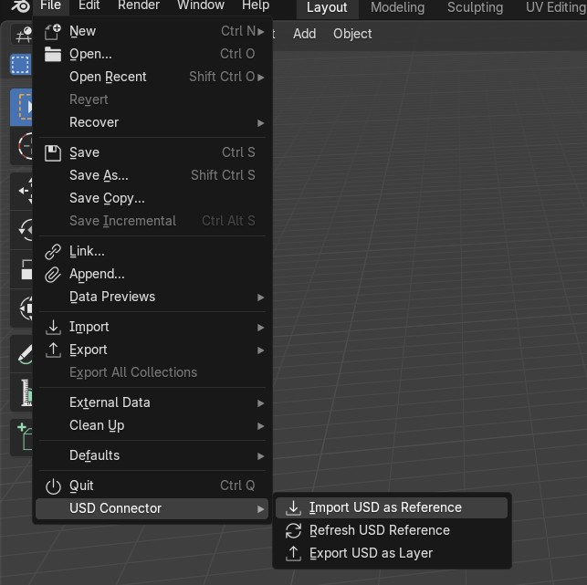
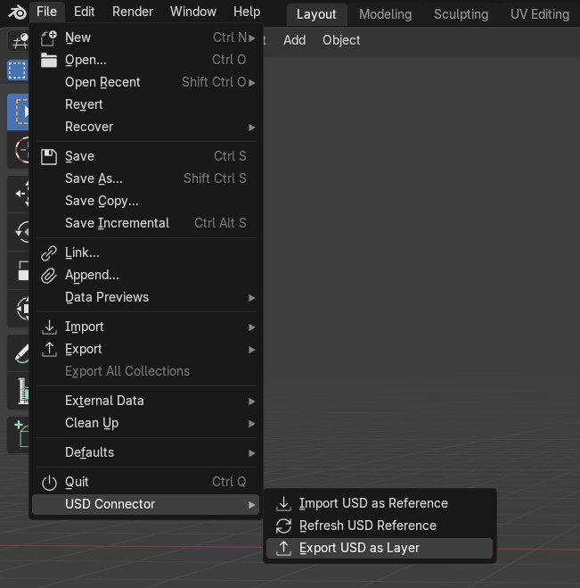
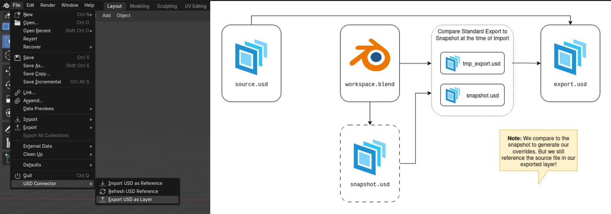
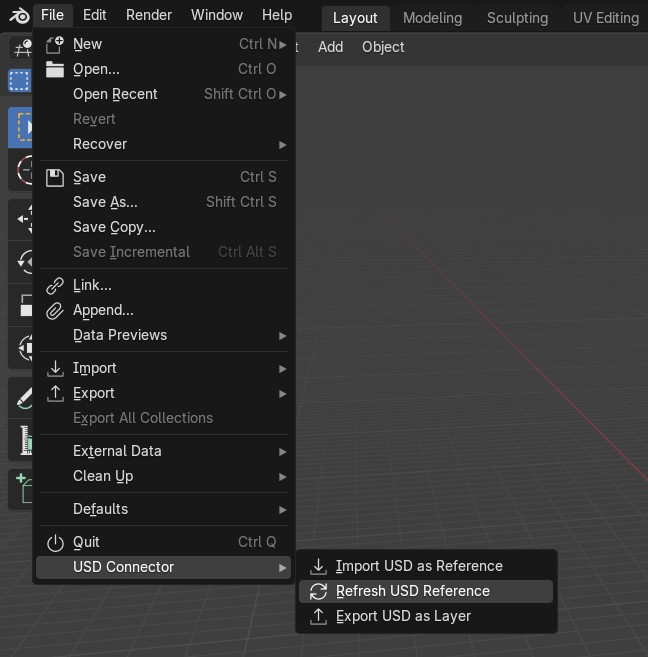

# Blender -> USD Connector

## Introduction
This is an example implementation of how USD support could be improved in Blender. This is an add-on that allows USD Layers to be generated from Blender against some USD data. This also allows for "refreshing" of USD data in Blender to load updated from the source USD files into Blender.

## Use Cases
Blender's native USD Exporter will always export a full copy of the USD Data out of Blender. 

In most USD based pipelines each DCCs typically will generate layers which contain only the modifications that were added on top of a source file. This implementation allows for a Studio to load in some USD data into Blender, such as a model in the context of a asset creation pipeline, and export only the modifications as a new layer, to be loaded by downstream departments. The secondary use case of this implementation is to load "updated" from upstream departments into a Blender session while preserving the local changes in the form of overrides.

## Importing USD Data

During Import we take a flattened snapshot of the USD file at the time of import. We also add some metadata to all prims so we can track their sources in later steps. In blender invoking this process is done by using a special importer that takes advantage of USD Hooks in Blender 

 


Let's take a look at a real world example comparing the USD data in USD View versus how it is manifested inside of Blender.
On the left we can see our USD data on the right is it's import into Blender and as expected they currently match. (Assuming the data you are importing is supported by Blender's USD importer).

 


## Exporting USD Data
At the time of export we temporarily create a full USD Export of our scene using Blender's native USD Exporter, and then we can compare that file to the snapshot of the source file to find only the changes made in Blender.

 

 Let's assume we make some simple modifications to our file. Such as changing the position, scale and rotation of our objects. We can then export that data and see our new composition in the `usdview`.  

 


Here is a sample of the usd data that was exported. As you can see, we are only defining overrides on some prims, as opposed to redefining every single prim.

```
#usda 1.0
(
    subLayers = [@source.usda@]
)

over "root"
{
    over "Sphere"
    {
        float3 xformOp:scale = (0.33598453, 0.33598453, 0.33598453)
        double3 xformOp:translate = (0, -0.28551924228668213, 1.9824588298797607)
    }

    over "Cube_A"
    {
        float3 xformOp:rotateXYZ = (-36.15339, 42.571255, -30.909925)
        double3 xformOp:translate = (0, 0, 0)
    }
...

```

## Re-composing scene in usdview
The amazing part of USD is that simply by updating our source file we can re-compose the scene with some modifications. Let's take a look at how that manifests inside of `usdview`.

We can modify our cube to be a pyramid, and we can stretch our sphere out to the shape of a capsule in our source file (left) this will automatically be re-composed onto our export file (right) while maintaining or transformation modifications. Note the differences in the composition stack on the bottom right panel of each `usdview` window.

 __Although these updates will not be loaded into blender since it stores a copy of our USD data.__

 


## Re-composing scene in Blender
We can take this a step further, by using Blender's native USD Importer / Exporter with some additional hook logic, we can take the layer generated by our custom exporter, and re-import it back into Blender and remap all the objects effectively "refreshing" our USD references, while maintaining any changes we made.

 

 Take a look at the same scene from above now re-composed by using this add-ons refresh function.

 Pictured ont op is our updated Blender session retaining our modifications. At the bottom we have our source usd file (left) and the results from our exported usd file (right).

 

## Authoring New Data
We can also add new data such as new objects in our Blender session and they will be defined in out `export.usd` file as new prims. This also is compatible with our refresh system, as we only remap the objects that are authored by USD Connect. Seamlessly integrating USD data with local blender data.

 

Here is how that manifests in our usd file.
```
#usda 1.0
(
    subLayers = [@source.usda@]
)

over "root"
{
    over "Sphere"
    {
        float3 xformOp:scale = (0.335985, 0.335985, 0.335985)
        double3 xformOp:translate = (0, -0.285519003868103, 1.9824600219726562)
    }

    over "Cube_A"
    {
        float3 xformOp:rotateXYZ = (-36.153408, 42.5713, -30.909904)
        double3 xformOp:translate = (0, 0, 0)
    }


    def Xform "Suzanne"
    {
        custom string userProperties:blender:object_name = "Suzanne"
        float3 xformOp:rotateXYZ = (2.2727437, -27.876757, 6.720067)
        float3 xformOp:scale = (1, 0.99999994, 1)
        double3 xformOp:translate = (2.5021188259124756, 0.6593396663665771, 1.2065078020095825)
        uniform token[] xformOpOrder = ["xformOp:translate", "xformOp:rotateXYZ", "xformOp:scale"]

        def Mesh "Suzanne" (
            active = true
        )
        {
            float3[] extent = [(-1.3671875, -0.8515625, -0.984375), (1.3671875, 0.8515625, 0.984375)]
...
```

## Notes
- Currently this implementation does not support materials
- The override generation logic is still a work in progress
- Consider this project a proof of concept not ready for production use